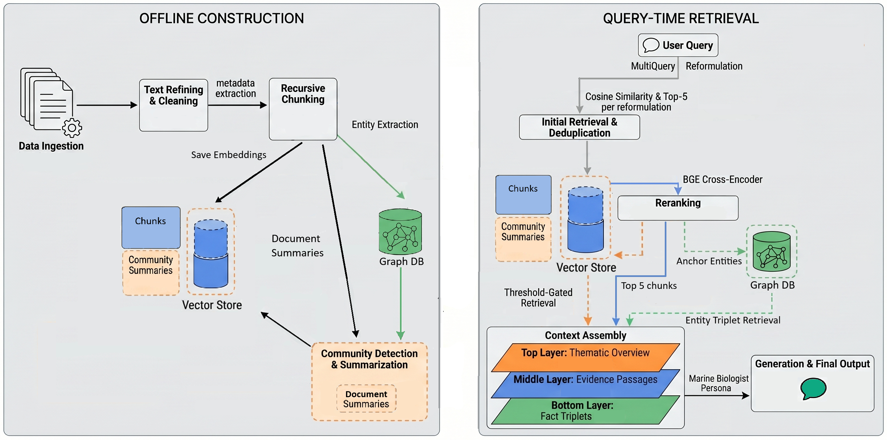

# AlgaeBot: A Hybrid GraphRAG System for Scientific Literature

[](https://algaebot.filipnovy.dk)
[]()

AlgaeBot is a domain-specific retrieval-augmented generation system that answers
questions over 879 peer-reviewed articles from the journal *Algae* (Korean
Society of Phycology, 1986--2024). It combines dense vector retrieval with a
bipartite knowledge graph to investigate whether entity-level graph expansion
and community-level thematic summaries interact to improve answer quality.

This repository contains the full implementation, evaluation pipeline, and
experimental notebooks from my MSc thesis in Data Science at the University of
Southern Denmark (supervised by Tariq Yousef). A paper based on this work has
been submitted to KONVENS 2026.

## Architecture



The system operates in two phases. During **offline construction**, documents
are extracted, chunked, and embedded into ChromaDB. In parallel, an LLM extracts
entities and relationships from each chunk, which are ingested into a Neo4j
knowledge graph. The entity graph is partitioned into thematic communities via
the Leiden algorithm, and each community is summarized into a prose paragraph.

At **query time**, the user's question is reformulated through MultiQuery
retrieval, reranked with a cross-encoder, and optionally enriched with two
knowledge-graph-derived context sources: one-hop entity-level triplets and
community-level thematic summaries. A generation LLM synthesizes the assembled
context into a cited answer.

## Key Findings

The central result is a **super-additive interaction** between graph expansion
and community summaries. Through a controlled 2-by-2 ablation across 203
evaluation questions scored with RAGAS, we find that:

- Entity-level graph expansion alone is actively harmful to faithfulness
  (Delta = -0.021) and context precision (Delta = -0.084).
- Community summaries alone provide a modest improvement (Delta = +0.008).
- The full system achieves Delta = +0.039 on faithfulness, exceeding the
  additive prediction of -0.013. The graph-expanded versus full GraphRAG
  comparison is statistically significant (Tukey HSD, p = 0.019).

We attribute this to a **format mismatch**: raw entity triplets are structured
symbolic assertions that the language model must translate into prose reasoning.
Community summaries provide the narrative frame that allows these triplets to
contribute as evidence rather than noise.

| Condition          | Faithfulness | Answer Relevancy | Context Precision | Context Recall |
|--------------------|-------------|-----------------|-------------------|----------------|
| Baseline (vector)  | 0.8089      | 0.5807          | 0.4224            | 0.5683         |
| Graph-expanded     | 0.7879      | 0.5838          | 0.3380            | 0.5357         |
| Community          | 0.8172      | 0.5898          | 0.4034            | 0.5784         |
| Full system        | 0.8476      | 0.5691          | 0.2376            | 0.5490         |

## Technical Stack

| Component          | Technology                                              |
|--------------------|---------------------------------------------------------|
| Vector database    | ChromaDB with BGE-base-en-v1.5 embeddings               |
| Knowledge graph    | Neo4j (bipartite: lexical subgraph + domain subgraph)   |
| Entity extraction  | DeepSeek-chat with instructor library (Pydantic schema) |
| Retrieval          | LangChain MultiQueryRetriever + BGE cross-encoder       |
| Community detection| Leiden algorithm (igraph + leidenalg)                    |
| Generation         | GPT-5-nano (cloud) / Gemma 4 (local via Ollama)         |
| Evaluation         | RAGAS (faithfulness, answer relevancy, context precision, context recall) |
| Chunking evaluation| HOPE metric (Brådland et al., 2025)                     |
| Entity resolution  | GBIF Backbone Taxonomy API                              |
| Frontend           | Streamlit                                               |
| Deployment         | DigitalOcean App Platform + HuggingFace Datasets         |

## Repository Structure

```
project/
  src/
    algaebot.py                 Streamlit web interface
    config.py                   Central configuration (all hyperparameters)
    pipeline.py                 Query-time orchestration
    download_db.py              HuggingFace vector database downloader
    retrieval/
      retrieve.py               Embedding, vectorstore, MultiQuery, graph expansion
      rerank.py                 Cross-encoder reranking
      community.py              Community summary retrieval (threshold-based)
      router.py                 Agentic query router (few-shot classification)
    generation/
      generate.py               Context assembly and answer generation
    ingestion/
      1_extraction.py           PDF text extraction pipeline
      2_processing.py           Text cleaning, metadata extraction, summarization
      3_chunking.py             Chunking strategies (recursive, semantic, RSC)
      4_embedding.py            ChromaDB indexing
      graph.py                  Entity/relationship extraction and Neo4j ingestion
    evaluation/
      evaluate_pipeline.py      RAGAS evaluation harness
    visualization/
      visualize.py              Plotly/NetworkX graph expansion visualization
  notebooks/
    evaluation/
      HOPE.ipynb                Chunking strategy evaluation
      RAGAS.ipynb               Testset generation and baseline-vs-hybrid comparison
      Semantic Independence.ipynb  Bootstrap-resampled zeta_sem evaluation
    experiments/
      Chunking Experiment.ipynb
      Communities.ipynb         Leiden detection, community summary generation
      Embedding experiment.ipynb
      Generation Experiment.ipynb
      Multiquery_experiment.ipynb
      Retrieval Experiment.ipynb
    pipelines/
      hybrid rag experiment.ipynb
    extraction.ipynb            PDF corpus processing
    dbQueries.ipynb             Neo4j graph queries and statistics
    Knowledge Graph_prototype.ipynb  KG schema design and pilot extraction
  data/                         ChromaDB, chunks, extractions, community summaries
  outputs/
    ragas_final/                2-by-2 ablation results (4 CSV files)
    ragas_extended/             Combined MANOVA input (812 rows)
    HOPE/                       Chunking evaluation results
```

## Quick Start

**Requirements:** Python 3.10+, a running Neo4j instance (for graph features),
and API keys for DeepSeek and/or OpenAI.

```bash
git clone https://github.com/filipnovy/algaebot.git
cd algaebot/project
pip install -r requirements.txt
cp .env.example .env   # add your API keys
streamlit run src/algaebot.py
```

On first launch, the application downloads a pre-built vector database snapshot
from HuggingFace Datasets (~1.7 GB), avoiding the need to re-embed the corpus.
Set `USE_GRAPH = True` in `config.py` and ensure Neo4j is reachable to enable
knowledge graph features. The community summaries collection is loaded
separately from `data/community_summaries/`.

## Configuration

All pipeline parameters are centralized in `src/config.py`:

| Parameter                | Value               | Description                                      |
|--------------------------|---------------------|--------------------------------------------------|
| N_QUERIES                | 5                   | MultiQuery reformulations per query               |
| TOP_K_RETRIEVAL          | 5                   | Chunks per reformulation                          |
| TOP_K_RERANK             | 5                   | Chunks retained after cross-encoder reranking     |
| COMMUNITY_TOP_K          | 3                   | Community summaries retrieved                    |
| COMMUNITY_MAX_DISTANCE   | 0.30                | Cosine distance threshold for summary activation  |
| DEGREE_CAP               | 100                 | Maximum entity degree for graph expansion         |
| LEIDEN_RESOLUTION        | 8.0                 | Leiden community detection resolution             |
| EMBEDDING_MODEL          | BAAI/bge-base-en-v1.5 |                                                   |
| RERANKER_MODEL           | BAAI/bge-reranker-base |                                                 |
| API_REFORMULATION_MODEL  | deepseek-chat       |                                                   |
| API_GENERATION_MODEL     | gpt-5-nano          |                                                   |

The 2-by-2 ablation is controlled by two boolean toggles: `USE_GRAPH` enables
entity-level triplet injection, and `USE_COMMUNITY_SUMMARIES` enables
community-level context. Setting both to `False` runs the baseline.

## Evaluation

The evaluation pipeline (`src/evaluation/evaluate_pipeline.py`) runs a RAGAS
testset through the pipeline and scores the results. The final ablation used
203 automatically generated questions across three RAGAS query types (simple,
relational, abstract), evaluated by DeepSeek-chat as the LLM judge.

Results are in `outputs/ragas_final/` (per-condition CSVs) and
`outputs/ragas_extended/manova_input_203.csv` (combined dataset for statistical
analysis). A two-way MANOVA (condition × query type) with Tukey HSD post-hoc
comparisons was used to assess significance.

## Citation

If you use this work, please cite:

```bibtex
@misc{novy2026algaebot,
  title        = {Domain-Specific Chatbot for Algae Research: A Hybrid GraphRAG Approach},
  author       = {Filip Nov\'{y}},
  year         = {2026},
  school       = {University of Southern Denmark},
  type         = {MSc Thesis}
}
```

## License

This project is licensed under the MIT License. See `LICENSE` for details.

## Acknowledgments

Supervised by Associate Professor Tariq Yousef, Department of Mathematics and
Computer Science, University of Southern Denmark. The corpus of 879 papers was
provided by the supervisor from the journal *Algae* (Korean Society of
Phycology).
