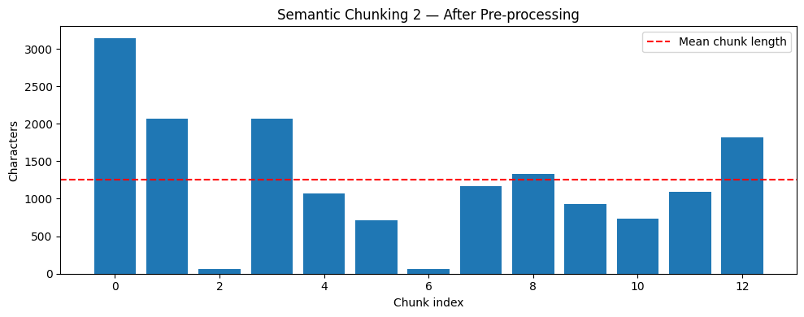
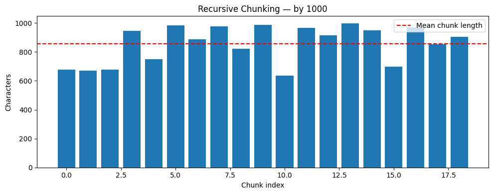
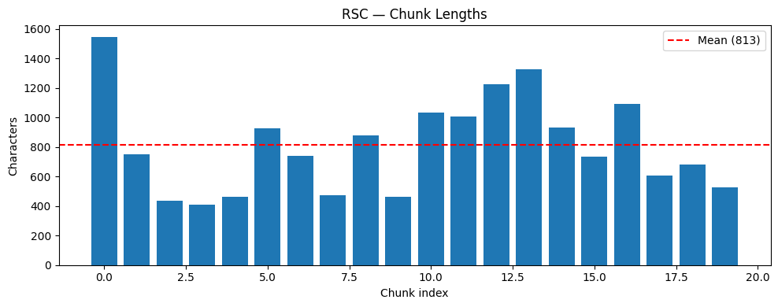
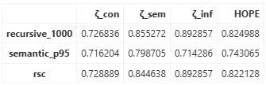
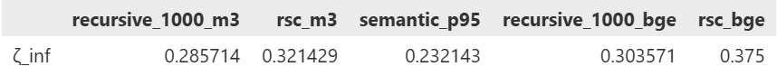

# 4. 2. 2026 - started working on a simple pipeline

from langchain documentation:

| **Architecture** | **Description** | **Control** | **Flexibility** | **Latency** | **Example Use Case** |
|:-----------|:-----------|:-----------|:-----------|:-----------|:-----------|
| **2-Step RAG** | Retrieval always happens before generation. Simple and predictable | ✅ High | ❌ Low | ⚡ Fast | FAQs, documentation bots |
| **Agentic RAG** | An LLM-powered agent decides *when* and *how* to retrieve during reasoning | ❌ Low | ✅ High | ⏳ Variable | Research assistants with access to multiple tools |
| **Hybrid** | Combines characteristics of both approaches with validation steps | ⚖️ Medium | ⚖️ Medium | ⏳ Variable | Domain-specific Q&A with quality validation |

# 16. 2. - trying to get OCR to work

downloaded popper and tesseract in order to be able to read unorganized pdf. I was succesful. Now I have a simple pipeline for reading a pdf, chunking and a I tried my first query: ; ´´ *What is Zostera marina?* ´´ and the answer was ´*Retrieved Context: Zostera marina Linnaeus, Figs 53-59 Figs 53-59. Zostera marina. 53. Apex with seven veins (Ve). 54. Surface of leaf. 55. Surface of seed coat. 56. Longitudinal section of seed coat. 57. Transverse sec ...*´. This is a bit disappointing because it is the description of a picture. So I tried to adjust the chunking strategy from elements to single but it changed nothing.

next steps: **Retrieval Augmentation by Re-ranking**. Instead of just looking at the top result, inspect the inferior matches

# 17. 2. - Integrating OpenAI api

I signed up for the OpenAI platform and through that, I called gpt5-nano.

I got: Zostera marina is a seagrass species (marine eelgrass) and is the type species of the genus Zostera. as the output for above context and the prompt *Answer the question based on the context below*.

# 19. 2. Meeting

main aim - working pipeline from import to generating answer

we want to optimize different components - chunking, reranking

implement: you are a marine scientist, practitioner in this field, what would aoyu answer given this context…

lets spend this week on optimizing the prompt before moving onto the next stage (adding knowledge graph). Optimize prompt -\> record results. It should be done in a systematic, scientific way. 

prompt -\> reranker -\> knowledge graph. Keep chunking, add multiquery -\> optimize prompt

1 question -\> top 3 retriever -\> smart retriever -\> enhancing with multiQuery 

# 24. 2. News

chunking changes retrieved different & better context:

"Retrieved Context: Note: This species often occurs in exposed area. Phyllospadix japonica Makino

Plants 40 cm high. Leaves obtuse in tip, three in vein, 0.15 cm broad, di- and tridentate with spine cells in mar- gin, w ..."

-   did literature review of a lot of papers. I read ***A comprehensive taxonomy of prompt engineering techniques forlarge language models*** in detail and implemented its insights for a better prompt:

-   [**First attempt**]{.underline}

    *Role: You are an experienced marine biologist and algae cultivation specialist. Task: Given the following retrieved context from scientific literature, answer the user's question. Base your answer strictly on the provided context. If the context is insufficient, say so. Domain constraint: Focus on the user's specific industry context. Output format: Brief paragraph with a traceable callback to the used chunk.*

    *Answer the question based on the context below.*

-   [**Output:**]{.underline} *Zostera marina Linnaeus is the type species of the genus Zostera, a submerged seagrass (marine angiosperm) commonly found on muddy substrates in the sublittoral zone, with reproduction concentrated in summer. In the provided material, Z. marina is described as plants about 34 cm tall, submerged, with leaves obtuse and three veins, around 0.2 cm broad; seeds are about 2.5–0.7 cm long and 0.2 cm broad, with a rough seed testa. (Zostera marina section in the Cho & Boo marine flora text)*

-   [**Refined Prompt:**]{.underline}

    """

    Role: You are an experienced marine biologist and algae cultivation specialist with deep expertise in seagrass ecology, microalgae biotechnology, and industrial algae applications. You prioritize scientific precision, cite specific data when available, and clearly distinguish between established findings and uncertainties. Task: Given retrieved passages from scientific literature on algae and marine biology, answer the user's question following these steps:

    1.  First, assess which of the provided passages are relevant to the question and briefly note why.
    2.  Synthesize information from the relevant passages into a coherent answer.
    3.  If passages contain conflicting information, acknowledge the conflict and explain both positions.
    4.  If the provided context is insufficient to fully answer the question, state what is missing. Domain constraint: Focus on the user's specific industry context. Output format: Brief paragraph with a traceable callback to the used chunk.

    Keep your answer grounded strictly in the provided context. Do not introduce external knowledge beyond what is given. Match your answer's depth to the question's complexity: give concise answers to simple questions, detailed analysis to complex ones.

    Context: {retrieved_context}

    Question: {query} Answer:

-   """

-   [**Refined Output:**]{.underline} Relevant passages identify Zostera marina as the type species of the genus Zostera and provide a detailed species description. Zostera marina is described as a submerged, coastal seagrass and the genus type (Zostera marina Linnaeus). In the source, Z. marina is a plant about 34 cm tall, submerged, with leaves obtuse at the tip, three veins per leaf, and about 0.2 cm wide; seeds are described as 2.5–0.7 cm long and 0.2 cm broad, with a rough seed testa. It grows on muddy substrates in the sublittoral zone and reproduces in summer. (Traceable to: Cho & Boo, Marine Green Flora of Oeyondo Islands, Zostera marina entry).

-   Comments: Now the prompt cites the concrete name of the paper, so it has better source attribution. the factual correctness is good in both. I could also check for hallucinations and completeness, but right now I am not sure how I am going to evaluate it in detail.

    # 4. 3. Progress

    **extraction.ipynb** - handles converting the whole corpus of documents to json with either regular loader or OCR for scans.

-   The process of converting PDFs is taking a long time, over 2 hours now. I discovered that by reversing the order of processed documents from newest to oldest, I can extract the vast majority in a fraction of the time, since pre 2007 documents are usually scanned. They take long to process, especially if they are in Korean.

    **Chunking.ipynb** - This notebook is dedicated to testing one of chunking strategies - text splitting and semantic chunking. Based on my literature review ad consultations with my supervisor, I believe semantic to be the best. I also read that overlap in text splitting is redundant and costs performance. I am also considering using recursive semantic and agentic chunking, inspired by a paper i read.

    ## Notes for RS Chunking

    *Segmentation of Textual Data from Files: The data store consists of files fi containing textual data stored as strings Ti. Since LLMs have token limits, eachTiundergoes a length check.If it exceeds the threshold T_max, the file is split into smaller segments{t1,t2,...,tn}, ensuring that \|tj\| ≤ T_max. The splitting occurs at the nearest sentence boundary (e.g., full stop, question mark) to preserve linguistic coherence.*

    *Excessive chunking can inflate the re-trieval space, leading to fragmented context*

-   *\>\>Direct quotes from The Chunking Paradigm: Recursive Semantic for RAG Optimization*

-   apaprently computationally expensive so the authors dont even recommend it

## Agentic chunking

Too expensive apparently, might try later

# 5. 3. Progress

All PDF parsing finished. Today I am trying 3 types of chunking on one test document to familiarize myself with different approaches, then I plan to apply it to the whole corpus

## Semantic Chunking

Semantic chunking at p95 proved inadequate for my test paper. The first 5 chunks are outsizedly large and the last ones are very short and disjointed - the references table got chunked.


## Preprocessing

Based on my findings, I discovered that preprocessing is necessary. First to purge acknowledgements and references, since they contain no knowledge. and then figures descriptions, because they are dense with keywords BUT have very limited value without seeing the picture.

Now that I got rid of figures, I want to extract the necessary information for citations so I can save them in a json. I want to extract: \* title: one of the first things written in the document

\* author: right under title

\* journal: all my documents are from the journal *Algae*

\* year: also in the file name

\* volume/issue: same

I decided to use [ollama]{.underline} to find title and authors with an llm. At first, I tried Mistral 7B, but it took 58 seconds. Then I tried Gemme3:1b and it took just 1.8 seconds.

# 7. 3. Progress - summarizing

Creating summaries of each document with different models.

Used prompt:

*You are a marine biology research librarian cataloguing scientific papers. Summarize what this paper covers in 2-3 sentences. Focus on: - Which species, organisms, or biological processes are discussed - Key findings or data reported - The geographic or ecological context*

*Be specific with species names and factual claims. This summary will be used to match the paper to future research queries.*

"

With [*Gemma 1b*]{.underline}, I originally got this answer: "summary": "Okay, here’s a summary of the paper, suitable for matching to future research queries, based on the provided text:\n\n\*\*Summary:\*\*\n\nThis paper documents a marine floral survey of the Oeyondo Islands on the Yellow Sea, Korea, conducted between 1992 and 1994. The survey focused on identifying and documenting nine genera and eighteen species of green algae and seagrasses within this unique marine ecosystem. Researchers, including Lee and Kang (1986) and Cho and Boo (1996), have previously studied these species through botanical descriptions and illustrations. The survey aimed to create a comprehensive catalog of the algal flora of the Oeyondo Islands, a geographically isolated area known for its rich marine biodiversity. The paper includes detailed illustrations, taxonomic keys, and descriptions of the species, highlighting the significance of this study for understanding the biogeography of marine algae in the Yellow Sea region.\n\n\*\*Key Findings/Data:\*\*\n\n\* The survey identified nine genera and eighteen species of green algae and seagrasses.\n\* Detailed illustrations and taxonomic keys were developed for all taxa.\n\* The study focused on the flora of a geographically isolated island, Oeyondo Islands, known for its unique marine ecosystem.\n\n\*\*Geographic/Ecological Context:\*\*\n\nThe Oeyondo Islands are an isolated island located on the Yellow Sea, Korea, characterized by rich marine flora and a history of isolated coastal habitats. The paper directly relates to the study of algal biodiversity within this specific, geographically defined marine environment.\n\n---\n\nWould you like me to refine this summary further, perhaps by adding specific details about the algal species, or focusing on a particular aspect of the methodology?",

Which is not satisfactory, it addresses the user and thats useless for retrieval. so I added this clause to the prompt: *Do not include any questions, headers, or bullet points. Return only the summary sentences*

**Gemma 3:1b:** "summary": "The paper describes a marine floral survey of benthic green algae and seagrasses on the Oeyondo Islands, a Korean archipelago island located in the Yellow Sea, focusing on nine genera and eighteen species of green algae and five species of seagrasses. The survey dates back to 1992-1994 and highlights the unique marine flora of the island, with detailed illustrations and taxonomic classifications." Runtime: 17.7 s.

**Gemma 3:4b:** "summary": "This study documented the marine flora of the Oeyondo Islands, located in the Yellow Sea off the Korean coast, focusing on benthic green algae and seagrasses collected between 1991 and 1993. Researchers identified nineteen species, including thirteen green algae genera and five seagrass species, and provided detailed illustrations and descriptions for each taxon, contributing to a better understanding of marine biodiversity in this region. The research aimed to build upon previous studies of the Yellow Sea and the islands’ unique flora, compiling a comprehensive list and documenting the species' characteristics through morphological observations and measurements.", Runtime: 1 min 13 s

**Granite 3.2:2b:** "summary": "This paper, "Marine Flora of Oeyondo Islands on the Yellow Sea, Korea: I. Green Algae and Seagrasses" from The Korean Journal of Phycology (Volume 13, Issue 1, 1998), focuses on a detailed survey of benthic marine green algae and seagrasses in the Oeyondo Islands, situated 50 km from the Korean mainland in the Yellow Sea. The research, conducted from 1992 to 1994, yielded a list of nine genera and eighteen species, including thirteen green algae and five seagrasses. The authors, Tae Oh Cho and Sung Min Boo, provided comprehensive illustrations, keys, and descriptions for each taxon. The study aimed to enhance the understanding of marine flora in isolated islands, contributing to the knowledge of species diversity and biogeography in Korean marine algae. The research methodology involved collecting samples bimonthly from three littoral and one sublittoral site, fixing them with neutral formalin, and conducting observations and anatomical examinations under microscopes. The identified species' nomenclature followed Yoshida et al. (1995), with uncertain species excluded from the list. All specimens were herbarium-mounted and deposited at Chungnam National University's Department of Biology.", Runtime: 1min22

I went with Gemma 3:1b because it is good enough after I modified the prompt and others would run prohibitively long, but Granite looks promising with how detailed it is.

## Recursive Chunking

## Semantic Chunking

It improved after pre processing. Some chunks are stil short, but meaningful. for instance:

```         
"chunk_id": 6,       "text": "They are distributed on the temperate to the tropical coasts.",       "char_length": 61
```



## Recursive Chunking



# 8. 3. Progress: finished recursive semantic chunking



RSC balances length and semantic meaning well, where there are no orphaned chunks or oversized ones unfit for efficient retrieval, so i am going to use it.

# 9. 3. Progress

Recursive and semantic chunking complete. built a retrieval script in a separate notebook to test retrieval on recursive chunks with the Zostera marina question again. The results look promising, though Iˇve noticed that Gemma3.1:3b might have hallucinated a paper's title(*"Deep Learning for Image Recognition"*), might look into that more later. I have also been reading up on HOPE and started to implement it. I want to compare each chunking strategy so i can then choose just one to go with for finishing the pipeline. RSC chunking is still running, it is extremely time consuming on my hardware.

# 10. 3. Progress

Tested semantic chunking on the same query, "What is Zostera marina?" and the answer was worse. the distance was further 0.70+-1 vs 0.61+-2. Then I generated responses with my prompt based on both chunks.

## Recursive chunks answer

-   Relevance assessment: The 2005 study on restoration of Zostera marina habitats is directly relevant; it characterizes Z. marina as a seagrass species that forms coastal seagrass beds and notes its ecological roles (nutrient cycling, sediment stabilization, and providing food and habitat for marine life). This is the core definition needed.

-   Answer: Zostera marina is a seagrass species (Zostera L.) that forms coastal seagrass beds and plays key ecological roles in those habitats, including nutrient cycling, stabilizing sediments, and providing food and habitat for a variety of marine organisms. This description is drawn from the restoration-focused source, which states that seagrass beds are important in coastal ecosystems and that Z. marina is an important species within that context (Park et al., 2005, Selection of the Optimal Transplanting Method and Time for Restoration of Zostera marina Habitats).

## Semantic chunks answer

Zostera marina is a marine seagrass species, commonly called eelgrass, that forms coastal seagrass beds. It plays a key ecological role by contributing to nutrient cycling and sediment stabilization, and by providing food and habitat for a diversity of invertebrates and fishes. It is also a focal species for restoration efforts, with transplantation experiments used to select optimal methods and timing for habitat restoration. (Trace: Park et al., 2005, Selection of the Optimal Transplanting Method and Time for Restoration of Zostera marina Habitats)

## Meeting with Tariq

Verify if it hallucinates title names, but later. for now lets have a complete pipeline. then we can try to improve. my contribution - enhance above baseline. he says lets make a very good version of this and THEN use a knowledge graph. handle hallucinations, reranking. later graph see if it enhances or not.

## 11. 3 progress

**HOPE Metric Implementation (ζ_con)**

Began implementing the HOPE evaluation metric (Brådland et al., SIGIR 2025) to compare chunking strategies. HOPE consists of three sub-metrics: concept unity (ζ_con), semantic independence (ζ_sem), and information preservation (ζ_inf), averaged equally.

Today I implemented ζ_con and set it running overnight across all three chunking strategies (recursive_1000, semantic_p95, RSC). The setup: 30 randomly sampled documents (seed=42) that exist in all three chunk directories, with 10 chunks subsampled per document per strategy, totaling 900 LLM calls. For each chunk, the LLM (IBM Granite 3.2 8B via Ollama) extracts exactly 5 factual statements, which are then embedded with BAAI/bge-base-en-v1.5 and compared via pairwise cosine similarity. The average pairwise similarity is the chunk's concept unity score; the document-level score is the mean across chunks.

[Design decisions and justifications:]{.underline}

-   30 documents: sufficient for paired statistical comparison across strategies (Cohen 1988 — paired design with medium effect size d=0.5 achieves 80% power at n≈27).

-   10 chunks per document: reduces compute from \~36 chunks/doc average to a feasible overnight run on CPU while maintaining representativeness.

-   5 statements per chunk: fixed count ensures uniform pairwise comparisons across chunks.

-   Granite 3.2 8B over gemma3:1b: evaluation quality depends heavily on the evaluator model's ability to extract meaningful factual statements. 1B models are too unreliable for this.

-   Temperature 0.7 for statement generation, following the paper's recommendation of non-zero temperature for diversity.

-   Results saved incrementally after each document/strategy pair for crash resilience.

Intermediate results saving to `project/outputs/HOPE/hope_con_results.json`. Will assess results and failure rate tomorrow, then implement ζ_sem and ζ_inf.

# 13 . 3 progress - HOPE implemented

Concept unity evaluation completed overnight. 90 evaluations (30 docs × 3 strategies), 1,624 minutes total runtime on CPU with Granite 3.2 8B. Failure rate was low: 1.4% for recursive, 3.5% for semantic, 3.8% for RSC — all JSON parsing failures from granite's output.

Results: RSC (0.729), recursive (0.727), and semantic (0.716) showed no statistically significant differences (Wilcoxon signed-rank, all p \> 0.22). This aligns with Brådland et al.'s finding that concept unity operates within a narrow range and has minimal correlation with downstream RAG performance. The real differentiator is expected to be semantic independence (ζ_sem), which they found correlated with up to 56.2% improvement in factual correctness.

Proceeding to implement ζ_inf next, as it is computationally lighter (\~300 LLM calls vs ζ_con's \~900) and can run overnight. ζ_sem is the most expensive sub-metric (\~2,700 LLM calls) and will require more aggressive subsampling.

**NOTE FOR THESIS:** HOPE sub-metrics, particularly ζ_sem, could serve as domain-agnostic fitness functions for automated pipeline optimization approaches like RAGSmith, which I leave as future work.

## semantic similarity sample generated questions

**summary of paper in question:** "summary": "Here’s a summary of the paper focusing on the identified species and its context:\\n\\nThe paper details the discovery of a new species of algae, \*Hypoglossum sabahense\*, from Sabah, Malaysia, using molecular and morphological analysis. Researchers collected culture isolates of the genus \*Hypoglossum\* and employed the Germling Emergence Method and serendipity to identify this new species. The study highlights the challenges of taxonomic discovery in remote tropical environments and the role of laboratory cultures in revealing previously unknown species. \*Hypoglossum sabahense\* is a species within the Delesseriaceae family, characterized by specific morphological features that differentiate it from other \*Hypoglossum\* species.",

**Gemma 1b:** results for gemma 1b: What is the name of the species being investigated? Where was the species discovered? What is the primary focus of the study?

**Qwen3:4b:**

qwen took 27 mins to generate this: Questions:

What is the new species name described in this paper?

What is the family of the algae?

What is the phylum of the algae?. It does not seem better

Due to computational constraints, ζ_sem was evaluated on 15 documents using gemma3:1b. Bootstrap resampling (n=10,000) was applied to estimate confidence intervals and verify stability of the relative rankings. We note that a more capable evaluation model would likely produce more discriminative absolute scores, though the paired experimental design ensures the relative comparison between strategies remains valid.

# 15 . 3. - HOPE calculated, multiquery implemented

Counter-intuitively, simple fixed-size recursive chunking outperformed more sophisticated strategies on HOPE, particularly on semantic independence. This aligns with Brådland et al.'s observation that traditional assumptions about concept-aware chunking may be suboptimal. Semantic independence ran for 890 minutes on only 15 documents (resampling with 95% confidence implemented)



For multiquery I tried using the simplest model again, gemma3:1b. The results of the reformulation were staggeringly good.

**Qestion:** "What is Zostera Marina and where does it grow?"

**Alternative questions:**

-   What are the characteristics of *Zostera marina* and its geographic distribution?

-   What are the key ecological roles of *Zostera marina* within aquatic ecosystems?

-   How is *Zostera marina* currently being studied in terms of its life cycle and population dynamics?

-   What are the major factors influencing the distribution and abundance of *Zostera marina* across different environments?

-   What are the potential impacts of *Zostera marina* degradation on marine biodiversity and ecosystem services?

**prompt_text** = f"""You are an AI assistant helping to improve information retrieval for a scientific database about algae research.

Your task is to generate {n_queries} alternative versions of the given user question. Each alternative should approach the same information need from a different angle or use different terminology, so that together they can retrieve a broader set of relevant documents.

Provide these alternative questions separated by newlines. Do not number them. Do not add any explanation or preamble. Only output the alternative questions.

Original question: {{question}}"""

# 17. 3. progress - reranking, generation

Answer:

Zostera marina, commonly known as eelgrass, is an essential seagrass species found primarily in coastal and estuarine ecosystems. It plays a vital role in nutrient cycling, sediment stabilization, and providing habitat and food for a variety of marine organisms, particularly invertebrates. In the context provided, Zostera marina is prevalent in the Keret Archipelago, occurring mainly in areas influenced by freshwater where it forms bands in the shallow subtidal zones beneath Ascophyllum nodosum. It can also be found in more extensive populations in certain shallow bays and may thrive in the intertidal zone, being exposed during spring tides (source: [*http://dx.doi.org/10.4490/algae.2013.28.3.267*](http://dx.doi.org/10.4490/algae.2013.28.3.267)).

prompt adjustments:

-   return same langauge answer as the question.

-   Output format: Brief paragraph. You MUST cite every passage you use with its bracketed number \[1\], \[2\], etc. from the context headers. Use multiple citations to support your answer. Then at the end of your answer, list all sources of retrieved chunks by bracketed number, title, author, year.

-   

    2.  Synthesize information from ALL relevant passages into a coherent answer. You must draw from multiple sources where possible: do not rely on a single passage.
        -   If the original question is not in English, first translate it to English before generating alternatives. All alternative questions must be in English.

# 18. 3. App built, test run

The architecture is clean and each component is testable independently. The citation mechanism works which is crucial for scientific credibility. The Czech issue is annoying but expected, the model wasn't designed for it. The over-hedging is more interesting because it shows the model is following instructions too literally. Should do ,pre prompt engineering: sometimes its necessary to explicitly permit reasonable inference it seems.

## specs

Import structure:

-   retrieval.retrieve, retrieval.rerank for retrieval components

-   generation.generate for generation components

-   pipeline.py orchestrates everything

Key parameters (config.py):

\- N_QUERIES = 5 (reformulations)

\- TOP_K_RETRIEVAL = 5 (per reformulation)

\- TOP_K_RERANK = 5 (final chunks)

\- EMBEDDING_MODEL = BAAI/bge-base-en-v1.5

\- RERANKER_MODEL = BAAI/bge-reranker-base

\- GENERATION_MODEL = gpt-5-nano

## app demo

Welcome to Algaebot. Type 'quit' to exit

**Question: Z jaké řasy se dělá sushi?**

**Answer:**

Z wracení sushi se tradičně používá červená řasa Porphyra tenera. V textu je uvedeno, že tyto Porphyra slouží jako obal kolem sushi a jsou známy pod názvy laver, nori (Japonsko, Severní Amerika), Kim (Korea) a podobně. \[4\]

\[4\] Hack Sun Choi, Kyong Hee Choi, Tae Hoon Kim’, Choon Hwan Lee’ and Tae Hyong Rhew\* (2001). Characterization of Natural Plasmid and Construction of Putative Transformation Vector Using the Plasmid in Korean Red Alga, Porphyra tenera

**Question: What kind of seaweed is not used for sushi?**

**Answer:**

Assessment of relevance:

\- \[1\], \[2\], and \[5\] are directly relevant as they discuss which seaweeds are edible or used in Korea and list species such as Laminaria, Undaria, Porphyra, etc., which informs any inference about sushi usage. \[3\] and \[4\] provide supporting context on composition and cultivation but do not address sushi specifically.

Synthesis:

\- From the supplied passages, there is no explicit statement naming a seaweed that is not used for sushi. The texts note edible seaweeds including Laminaria, Undaria, and Porphyra, and they list several genera under industrial uses, but they do not map each species to sushi usage. Porphyra spp. are among the seaweeds discussed, and Porphyra is traditionally associated with edible products; however, the passages do not state whether Porphyra is used for sushi in these sources, nor do they specify which of the listed species are not used for sushi. Therefore, based on these sources, we cannot definitively identify a seaweed that is not used for sushi. Missing information: explicit linkage between the listed species and sushi usage.

Citations:

\- The discussion of edible seaweeds including Laminaria, Undaria, and Porphyra: \[1\].

\- The listing of species (including Porphyra spp. and Laminaria japonica) under industrial uses: \[2\].

\- Reiteration of seaweed uses and history in Korea (contextual background): \[5\].

Sources:

\- \[1\] Yoon Sik Oh, In Kyu Lee, Sung Min Boo (1990). The Korean Journal of Phycology Volume 5 (1): 57-71, 1990.

\- \[2\] Yoon Sik Oh, In Kyu Lee, Sung Min Boo (1990). The Korean Journal of Phycology Volume 5 (1): 57-71, 1990.

\- \[3\] Soo-Jin Heo, Ki-Wan Lee, Choon Bok Song and You-Jin Jeon (2003). Antioxidant Activity of Enzymatic Extracts from Brown Seaweeds.

\- \[4\] Eun Kyoung Hwang, Chan Sun Park (2020). Seaweed cultivation and utilization of Korea.

\- \[5\] Yoon Sik Oh, In Kyu Lee, Sung Min Boo (1990). The Korean Journal of Phycology Volume 5(1): 57-71, 1990.

## Initital pipeline results with RAGAS

EVALUATION RESULTS

{'faithfulness': 0.8520, 'answer_relevancy': nan, 'context_precision': 0.7277, 'context_recall': 0.5745}

### Takeaway

this is with bge-en, basic reranking, regular chunking (no latesplit). Baseline RAG achieved faithfulness of 0.85 and context precision of 0.73, indicating reliable generation from retrieved context. However, context recall of 0.57 suggests retrieval gaps, motivating the knowledge graph enhancement experiment.Baseline RAG achieved faithfulness of 0.85 and context precision of 0.73, indicating reliable generation from retrieved context. However, context recall of 0.57 suggests retrieval gaps, motivating the knowledge graph enhancement experiment.

## Conversation with memory (last 3 messages)

**User:** Is there an algae species that does not consume CO2?

**Algaebot:** From the provided passages, there is no evidence of an algae species that does not consume CO2. All described algae engage in CO2 uptake or fixation: general CO2 fixation by photosynthesis in algae and plants is highlighted (\[2\]); algae uptake CO2 from their environment to build organic matter and oxygen, with growth governed by light, temperature, and nutrients (\[1\]); calcareous/algal species can sequester CO2 by converting it into CaCO3 during calcification (\[3\]); and measured carbon uptake by Microcystis assemblies confirms active CO2 assimilation (\[4\]). The only CO2-related process that reduces CO2 differently is calcification into CaCO3, which nevertheless consumes CO2 (\[3\]). There is no conflicting information within these sources about a non-CO2-consuming alga; if such a species exists, it is not described in these passages and would require data beyond them. \[1\], \[2\], \[3\], \[4\]

Sources: \[1\] Surk-Key Kong, Nakajima Toshiuki (2002). Algae Volume 17(3): 195-199, 2002 \[2\] Mikio Tsuzuki, Naomi Shimoyama (1992). Utilization of Microalgae and IAM Culture Collection \[3\] Megumi Okazaki (1992). The Korean Journal of Phycology Volume 7(1): 147-154, 1992 \[4\] Ok-Hee Lee, Kyung-Je Cho (2004). Uptake of Carbon and Nitrogen by Microcystis Algal Assemblages in the Seonakdong River

**User:** then name 5 species that do

**Algaebot:** Relevance assessment: Passage \[1\] establishes that algae fix CO2 via photosynthesis, so any algae mentioned in the other passages would consume CO2. Passages \[2\], \[3\], \[4\], and \[5\] list specific algal species observed in Korean waters, providing concrete examples of CO2-using species in the context you asked about.

Five species that do consume CO2 (as photosynthetic algae): Sargassum thunbergii \[2\], Ulva pertusa \[2\], Corallina pilulifera \[5\], Lomentaria hakodatensis \[5\], and Chondria crassicaulis \[2\]. All are algae and thus participate in CO2 uptake through photosynthesis, per the general CO2 fixation described in \[1\].

Sources: \[1\] Surk-Key Kong, Nakajima Toshiuki (2002). Algae Volume 17(3): 195-199, 2002 \[2\] Mie SHS ime ABS RRO chsto, SFR HRM: SHR (ZEW K EKER GEILE EL) + EARL, Kim, Hyung Geun, *Chul Hyun Sohn and Jae Won Kang (1986). The Korean Journal of Phycology Vol. 1, No. 1: 169-183 (1986) \[5\] I. An intertidal marine benthic algal community at Sokcho, Jae Wan Lee, Hae Bok Lee and In Kyu Lee*, Ria Rol MRR Hs \| RES AM BRE, SSC: Filia A E\* (HAGE BETA DBL A\] SKE REHEARSE He Stpy\*, SE (1993). A Study on the Community Structure of Intertidal Marine Benthic Algae in the East Coast of Korea

**User:** Můžete mi na to odpovědět česky?

**Algaebot:** Relevantnost: pasáže \[2\] a \[5\] uvádějí konkrétní druhy řas, které se podílejí na fixaci CO2 photosyntézou, zatímco \[1\] shrnuje obecnou skutečnost o CO2 uptake u řas. Navržených pět druhů, které CO2 spotřebovávají (přes fotosyntézu), jsou Sargassum thunbergii \[2\], Ulva pertusa \[2\], Corallina pilulifera \[5\], Lomentaria hakodatensis \[5\], a Chondria crassicaulis \[2\]. Žádné konfliktní údaje v uvedených pasážích nenastávají; pokud by se objevily rozpory, byly by vyřešeny odlišnými pozicemi a doplňujícími daty. Celkově tyto záznamy ilustrují, že uvedené mořské řasy z Koreje aktivně využívají CO2 prostřednictvím fotosyntézy. \[2\], \[5\], \[1\]

Soubory citovaných pasáží: \[1\] Surk-Key Kong, Nakajima Toshiuki (2002). Algae Volume 17(3): 195-199, 2002 \[2\] Mie SHS ime ABS RRO chsto, SFR HRM: SHR (ZEW K EKER GEILE EL) + EARL, Kim, Hyung Geun, *Chul Hyun Sohn and Jae Won Kang (1986). The Korean Journal of Phycology Vol. 1, No. 1: 169-183 (1986) \[5\] I. An intertidal marine benthic algal community at Sokcho, Jae Wan Lee, Hae Bok Lee and In Kyu Lee*, Ria Rol MRR Hs \| RES AM BRE, SSC: Filia A E\* (HAGE BETA DBL A\] SKE REHEARSE He Stpy\*, SE (1993). A Study on the Community Structure of Intertidal Marine Benthic Algae in the East Coast of Korea

## Until next time

try a different embedding model and compare the same results with hope and ragas. base retrieving and reranking. test performance top 3/5 for example.

Test if reranking improves response time.

## Made an icon, started embedding with m3, refining prompt

[it works ok now:]{.underline}

***Algaebot:** Assessment of relevance: None of the provided passages address a personal name; they are bibliographic entries on algae, seagrass ecology, and related topics, not identity \[1\], \[2\], \[3\], \[4\], \[5\].*

*Synthesis and missing context: Because no source contains a name for me, there isn’t enough information to answer “What is your name?” from these passages. The context is insufficient to establish or assign a personal name. If you’d like, you may designate a name for me, but that would be an external convention rather than information drawn from the given sources.*

*Sources: \[1\] Hyun-Soo Kim, K. K. Asanka Sanjeewa, I. P. Shanura Fernando, BoMi Ryu, Hey-Won Yang, Ginnae Ahn, Min Cheol Kang, Soo-Jin Heo, Jun-Geon Je, You-Jin Jeon (2018). A comparative study of Sargassum horneri Korea and China strains collected along the coast of Jeju Island South Korea: its components and bioactive properties not identified. \[2\] La Kenya Evans1, Matthew S. Edwards1 (2011). Bioaccumulation of copper and zinc by the giant kelp Macrocystis pyrifera DISCUSSION. \[3\] Ju-Hyoung Kim, Eun Ju Kang, Keunyong Kim, Hae Jin Jeong, Kitack Lee, Matthew S. Edwards, Myung Gil Park, Byeong-Gweon Lee, Kwang Young Kim (2015). Evaluation of carbon flux in vegetative bay based on ecosystem production and CO2 exchange driven by coastal autotrophs DISCUSSION. \[4\] Michael Y. Roleda, \*, Zae-Zae A. Aguinaldo, Bea A. Crisostomo, Lourie Ann R. Hinaloc, Vicenta Z. Projimo2, Richard V. Dumilag, Arturo O. Lluisma (2021). Discovery of novel haplotypes from wild populations of Kappaphycus DISCUSSION. \[5\] Ralph A. Lewin and Lanna Cheng (1993). Discovery, Early History and Phylogeny of Prochloron ancestry?*

-   I wonder if I should adjust the prompt a bit so its a little.. bolder? Like its not wrong. but it provides quotes even though nothing of those cited papers were used! Thats something I overlooked

added this passage to the prompt:

If the provided context contains NO relevant information to answer the question, simply state that the question is outside the scope of the algae research database. Do not cite sources that weren't used. Do not list references if none were relevant.

If asked personal questions (your name, preferences, opinions), respond briefly as "Algaebot, an algae research assistant" without searching the literature.

### FIX WORKS AS INTENDED:

**User:** Whats the weather like in Punta Arenas?

**Algaebot:** The question is outside the scope of the algae research database; none of the provided passages discuss Punta Arenas or its weather. The excerpts focus on climate and algae in other regions (e.g., Bolivia, Baja California Sur) rather than Punta Arenas.

### Pipeline configuration options added

I decided that the config file could also be used to decide which parts of the process to do locally and which to do through openai api.

\# Local vs API toggle USE_LOCAL_GENERATION = False \# True = Ollama, False = OpenAI

# Models

LOCAL_GENERATION_MODEL = "gemma3:8b" \# or llama3, mistral API_GENERATION_MODEL = "gpt-5-nano"

LOCAL_REFORMULATION_MODEL = "gemma3:1b" API_REFORMULATION_MODEL = "gpt-4o-mini"

### New addition: local generation

Adjusted generate and config.py to allow switching between openai and local generation. Curerently qwen4b is used for local generation given the hardware that I have available.

Local generation with Qwen3-4B was tested but proved impractical on CPU-only hardware (\>15 min/response). Production deployment would require GPU acceleration or API-based generation

Gemma 1b answer:

# **Algaebot**

-   THe local model Gemma3:1b handled Czech BETTER than gpt nano 5.

**User:** Z jaké řasy se dělá sushi?

**Algaebot:** Sushi rolls (nori) se přípravou z modročerveného rybího rostliny \*Porphyra\* (často označované jako „nori“ v Japonsku). V kontextu je jasné, že \*Porphyra\* je specifický druh červeného rostliny používaný jako červenobílý obal pro sushi, který je vyroben z čistě zpracovaných \*Porphyra\* látek \[1\]. Tato rostlina je v Japonsku, Koreji a Číně využívána v potravinářském předpokladu a označována různými názvy, včetně „kim“ v Koreji \[3\]. Důležité je zdůraznit, že jiné rybiny, jako je \*Saccharina japonica\* (kelp) nebo \*Saccharina sculpera\* (modrá rybina), jsou používány v jiných oblastech (např. výroba alginátu nebo jídelního materiálu), ale nejsou standardním materiálem pro sushi \[4\], \[5\].

Zdroje: \[1\] Hack Sun Choi, Kyong Hee Choi, Tae Hoon Kim’, Choon Hwan Lee’ a Tae Hyong Rhew\* (2001). Characterization of Natural Plasmid and Construction of Putative Transformation Vector Using the Plasmid in Korean Red Alga, *Porphyra tenera*; \[3\] Hack Sun Choi, Kyong Hee Choi a Tae Hyong Rhew\* (2000). Simple and Rapid Isolation of Plasmids from *Porphyra tenera*.

### M3 embedding attempt

if ζ_con and ζ_sem are identical regardless of embedding, and m3 lost on ζ_inf, the HOPE average can only be worse for m3.

Since ζ_con and ζ_sem measure chunk-intrinsic properties independent of the embedding model, and bge-m3 did not outperform bge-base-en-v1.5 on ζ_inf, a full HOPE recomputation was unnecessary; bge-base-en-v1.5 was retained.



### M3 question and answer:

User: Jaká je minimální teplota, ve které přežije plankton? Algaebot: Na základě poskytnutých studií není přesná minimální teplota, při které by všechen plankton přežil, jednoznačně stanovena. Záznamy ukazují, že ambientní teploty v přírodě klesly až na 2.5°C (leden 2003) v Nakdongu, což svědčí o tom, že plankton dokázal přežít i při velmi nízkých teplotách \[1\], a v jiných lokalitách zimní teploty kolem 6–7°C byly spojeny s výskytem/planktonem (např. Naktong estuary) \[3\]. Na druhou stranu, u některých druhů (např. Microcystis aeruginosa) byla optimální teplota pro růst kolem 28°C a růst byl inhibován pod 17°C, tedy i když přežití může nastat při nižších teplotách, růst je výrazně omezen pod touto mezí \[3\]. V laboratorních podmínkách se u některých mikrorostlin ukázalo, že mohou fungovat i při teplotách kolem 10–16°C (např. Chlorella, Scenedesmus, Spirulina), což naznačuje širší toleranci k nízkým teplotám v kontrolovaném prostředí \[2\]. Obecně platí, že teplota ovlivňuje přežití a růst i u dinoflagellátů a dalších planktonních organizmů, a tedy kritickým faktorem není jen přežití při určitém minimu, ale i taxon-specifická odpověď na teplotu \[4\]. V extrémních podmínkách lab, cryoprezervace ukazuje přežití při velmi nízkých teplotách pod LN podmínkami, což ale není přírodní prostředí a slouží spíše jako poznámka o technikách uchovávání \[5\]. Celkově tedy: nejnižší ambientní teploty, při nichž bylo v literatuře zaznamenáno přežití planktonu, leží kolem 6–7°C (některé záznamy) a 2.5°C jako extrémní zimní hodnota prostředí, s tím, že růst bývá silně omezen pod kolem 17°C pro některé významné druhy \[1\], \[3\], \[2\], \[4\], \[5\]. Soubory použitých zdrojů: \[1\] You-Jung Lee, Jong-Mun Jung\*, Pan-Se Shin and Gea-Jae Joo (2005). Daily Variation of Phytoplankton and Water Quality in the Lower Nakdong River. \[2\] Meenakshi Bhattacharjee, Evan Siemann (2015). Low algal diversity systems are a promising method for biodiesel production in wastewater fed open reactors. \[3\] Kyung-Je Cho, Ik-Kyo Chung, Jin-Ae Lee (1993). Seasonal Dynamics of Phytoplankton Community in the Naktong River Estuary, Korea. \[4\] Jin Hee Ok, Hae Jin Jeong, Hee Chang Kang, et al. (2022).

## 30. 3. testing bge-en vs m3 on rsc chunks

### M3 test on multilingual retrieval: korean

**User:** 라플란드에는 어떤 해조류가 자라나요?

**Algaebot:** 이 질문은 Lapland의 해조류에 관한 것으로, 제시된 맥락은 한국 연안의 해조류 군집 연구들뿐이라 Lapland에서 자라는 해조류를 특정할 수 있는 정보가 없습니다. 현재 제공된 자료로는 라플란드 해안의 생태 특성, 기온·염분 조건에서의 북극/아틱 해조류 종 목록 및 계절 분포 같은 필요한 데이터가 누락되어 있어 답변이 불가능합니다. 추가로 필요한 정보는 라플란드 해안의 구체적 위치와 해양 환경 특징, 지역별 해조류 종 구성과 생태적 제약에 관한 데이터입니다.

### bge en on korean

**Algaebot:** 주어진 문헌들(\[1\]-\[5\])은 한국 연안의 해조류 분류, 담수 빨간알갱이류, 또는 환경 영향 하의 해조류 생물량 등 특정 지역이나 맥락에 국한된 연구로서, 라플란드의 냉수성 해안 생태계나 그 지역에 자라는 해조류 구성에 대한 정보는 포함되어 있지 않습니다. 따라서 라플란드에서 자라는 해조류의 구체적 목록이나 현지 생태를 이 데이터베이스에서 직접 확인할 수 없으며, 이 질문은 현재 제공된 자료의 범위를 벗어납니다. 라플란드의 해조류 정보를 얻으려면 북극권 해안의 냉수성 해조류 분포 자료나 현지 모니터링 자료가 필요합니다.

# 1. April: getting started with knowledge graph

I found this website <https://obofoundry.org/> that defines biology related ontologies, so i could create my relations based on their framework rather inveting something on my own.

also **The Environment Ontology (ENVO);**

OLS provides a hosted [Model Context Protocol (MCP)](https://modelcontextprotocol.io/docs/getting-started/intro) server which enables LLMs to access ontology terms and hierarchies: <https://www.ebi.ac.uk/ols4/api/mcp> (Please note that the type of this endpoint is **Streamable HTTP** and not legacy SSE)

-   The Sequence Ontology (SO) is required to describe specific features of biological sequences

-   For molecular and cellular studies, the Gene Ontology (GO) is utilized to provide standard classifications for biological processes

-    the Chemical Entities of Biological Interest (ChEBI) ontology is crucial for standardizing the representation of secondary metabolites, toxins, lipids, pigments, and industrially relevant polysaccharides extracted from algae

    ## 3. 4.

    adjusted prompt step 1:

    1.  First, internally assess which of the provided passages are relevant to the questions

    ### Ontological relations I found relevant

    -   `part_of` (BFO:0000050)

    <!-- -->

    -   `has_participant` (RO:0000057)

    <!-- -->

    -   `located_in` (RO:0001025)

    <!-- -->

    -   `derives_from` (RO:0001000)

    <!-- -->

    -   `has_input` / `has_output` (RO:0002233 / RO:0002234)

    -   `biotically interacts with`, `confers advantage in`, `creates habitat for`, `ecologically co-occurs with`, `has habitat`, `transmitted by`

    -   And ENVO documentation references `RO:located in` \[RO_0001025\] and `RO:surrounded by` \[RO_0002219\]

    -   Also causal relations exist: `causally upstream of`, `negatively regulates`, `positively regulates`, `regulates`

        ### Relation discovery prompt

        Read these sample papers. List every concrete relationship you observe between entities, in this format:

        (Entity A) → \[RELATIONSHIP\] → (Entity B)

        Focus on relationships like:

        Species producing/containing compounds

        Species found in locations/environments

        Methods applied to study species

        Parameters affecting biological processes

        Genetic markers used for identification

        Examples of what I want:

        (Porphyra birdiae) → \[FOUND_IN\] → (Northwest Atlantic)

        (Porphyra birdiae) → \[STUDIED_WITH\] → (rbcL sequencing)

        (Porphyra birdiae) → \[RELATED_TO\] → (Porphyra purpurea)

        List as many as you find. Don't explain — just list the triplets.

        ### Relations I settled on

        | Relation | Description | Example | RO Mapping |
        |------------------|-------------------|------------------|------------------|
        | FOUND_IN | Species located in environment or geographic location | *Ulva pertusa* → intertidal zone | has habitat (RO:0002303) |
        | PRODUCES | Species biosynthesizes or yields compound | *P. tricornutum* → fucoxanthin | has output (RO:0002234) |
        | STUDIED_WITH | Species analyzed using method or technique | *Porphyra* → rbcL sequencing | Domain-specific |
        | IDENTIFIED_BY | Species identified using genetic marker | *P. birdiae* → SSU marker | Domain-specific |
        | BELONGS_TO | Taxonomic hierarchy (species → genus → family) | *P. birdiae* → Porphyra | in taxon (RO:0002162) |
        | AFFECTS | Parameter or condition influences process or organism | salinity → growth rate | regulates (RO:0002211) |
        | CONTAINS | Species contains or is source of compound | Sargassum → alginate | has part (BFO:0000051) |

# 4.4. Progress - graph.py script to create graph from whole corpus

**What I built:**

-   Complete extraction pipeline using DeepSeek API + instructor library for structured output

-   Pydantic schemas with distinct field names (species_name, compound_name, etc.) to prevent LLM pattern-matching confusion

-   Nested "tackle box" response model (ExtractionResult) that organizes entities into separate drawers (taxa, compounds, methods, environments, markers, applications)

-   File-based caching system: one JSON per chunk, allows interruption and resumption without re-paying for API calls

-   Neo4j ingestion functions: lexical subgraph (Document → Chunk with PART_OF and NEXT_CHUNK edges) and domain subgraph (entity nodes + MENTIONS edges + domain relationships)

-   Auomated reporting: generates both detailed JSON and human-readable summary after each run

**technical decisions:**

-   Using instructor.Mode.JSON to enforce Pydantic schema compliance from DeepSeek

-   Confidence scores (0.0-1.0) on all relationships; filtering out \<0.5 before ingestion

-   MERGE instead of CREATE in Cypher to deduplicate entities across papers

-   Processing papers newest-first to avoid OCR garbage from pre-2010 documents

**Pilot results (100 chunks):**

-   551 entities extracted

-   436 relationships extracted

-   Entiy-to-relationship ratio: 1.26 (healthy)

-   15.1% orphan rate (acceptable)

-   1 error (1%)

**Status:** Full extraction running overnight (\~32,000 chunks, estimated \$10-12 on DeepSeek). Results will be in Neo4j tomorrow morning.

**Next steps:**

-   Validate graph structure in Neo4j Browser

-   Implement hybrid retrieval (vector + graph traversal)

-   

-   Re-run RAGAS evaluation to measure context recall improvement

# 9. 4. - starting to implement kg retrieval

I actually wanted to implement the knowledge graph already and hoped no one would notice the hallucations. I know gemma 1b is crap, but it was surprisingly powerful for what it is. Ive actually been thinking of swappin in gemma 4 e2b or e4b which came out recently. I wasnt thinking for the metadata extraction, for that it feels too late, but for reformulating and reranking. like.. you know. I already embedded the faulty metadata. cant i argue I could use no better model with my hardware? Yes, I can still embed the chunks.. WHERE THE TITLE CHANGED. damn, that could be brilliant, wouldnt it? then i wouldnt need to rerun the whole thing. but.. i already passed all my chunks to create the knowledge graph, so then the knowledge graph could have nodes for papers that dont truly bear that name, wouldnt that be a problem? idk man, i dont need a perfect rag system, just meet the goals of my thesis and build something I can be proud to present.

# 10. 4. progress

### insight:

read mycrosoft paper, conclusion: Edge et al. (2024) proposed community-based summarization for corpus-level queries. Our system targets entity-specific scientific questions where direct graph traversal provides more interpretable and efficient retrieval.

### thesis writing

I started writing my thesis where I drafted headlines, introduction and noted for future self what i need to write.

## **Changes Made**

**`config.py`** Two clear toggles (`USE_LOCAL_REFORMULATION`, `USE_LOCAL_GENERATION`), each with local/cloud model names. Removed dead `REFORMULATION_MODEL` and `GENERATION_MODEL` single variables.

**`retrieve.py`** Respects `USE_LOCAL_REFORMULATION` toggle. Uses DeepSeek API when `False`, Ollama when `True`. Updated docstring.

**`generate.py`** Updated to import `API_GENERATION_MODEL` instead of removed `GENERATION_MODEL`.

**`algaebot.py`** **Sidebar bug fixed.** `top_chunks` stored in `st.session_state`, sidebar rendered outside the `if user_input:` block so it persists across Streamlit reruns.

**`pipeline.py`** Fixed module docstring. Fixed 3-value unpacking in both console modes.

**`evaluate_pipeline.py`** Fixed 3-value unpacking (would have crashed next RAGAS run).

I noticed the chunk ids dont match in files and neo4j rn.

**note for thesis 2:**

*3 chunks were excluded from graph extraction due to token-limit errors on embedded tables; these remain retrievable via the vector store but contribute no graph triplets*

## Unplanned chroma reindexing detour

**Planned**: Wire up hybrid retrieval end-to-end. Write the graph expansion Cypher, the triplet reranker, and get a working baseline-vs-hybrid comparison on the two test queries (simple Zostera lookup, complex multi-hop salinity query).

**What actually happened**: Discovered during the first sanity check that the existing ChromaDB collection (`recursive_100`, contents are recursive_1000) did not store `chunk_id` in chunk metadata — only document-level fields (filename, title, authors, year). This made it impossible to join vector search results to the Neo4j knowledge graph at the chunk level, which is the architectural foundation of the whole hybrid retrieval approach.

The Neo4j `Chunk` nodes use `chunk_id` strings in the format `{filename_stem}_chunk_{index:03d}`, e.g. `algae-1986-1-1-117_chunk_000`. These IDs were constructed during graph ingestion from filename and within-file position, and are not present anywhere in the original Chroma metadata. The chunk JSON files on disk contain a `chunk_id` field but it's a local integer (0, 1, 2, ...), not the globally unique string.

**Decision**: Rebuild the Chroma collection from the same recursive_1000 chunk JSON files, this time constructing the Neo4j-format `chunk_id` from filename and position during ingestion and storing it in metadata. Same embeddings (BGE-base-en-v1.5), same chunks, same order — only the metadata is enriched. Baseline RAGAS scores remain reproducible because nothing about the retrieval behavior changes, only the ability to join to the graph.

Considered and rejected: joining Chroma results to Neo4j by exact text match on chunk content. Fragile (whitespace, encoding), undefensible at viva, zero upside over reindexing.

**Minor finding**: Chunk counts are 31,741 on disk vs 31,738 in Neo4j. The 3-chunk gap matches the handoff note about token-limit errors on chunks with huge embedded tables during KG extraction. Not a bug; these chunks remain retrievable via vector search but contribute no graph triplets. Worth acknowledging as a one-line limitation in the thesis.

**Status at end of session**: Reindexing cell written and tested on the data-loading step (31,741 chunks collected correctly). Actual delete-and-rebuild of the Chroma collection, and the \~20–40 minute embedding run, still pending. Hybrid retrieval itself not yet implemented.

**Lesson**: The hybrid architecture assumes a shared `chunk_id` join key between the vector store and the graph store. This should have been verified on day one of building the graph, not discovered on the day of wiring up retrieval. Worth flagging in the methodology chapter as a "lessons learned" footnote about dual-store RAG systems.

**Next session**: Run Cell 2 (delete + recreate collection), Cell 3 (batched add with embeddings). Verify final count is 31,741. Then resume the original plan: graph expansion Cypher, Gemma 4 E2B triplet filter, hybrid context assembly, side-by-side comparison on the two test queries.

## 11. 4. progress

**New: Hub node filtering**:

In knowledge graphs, some entities are highly connected "hubs", broad taxonomic categories like "Chlorophyta" (connected to every green alga species, every method, every compound). When graph traversal expands from a hub, it floods the results with generic, low-value facts, drowning out specific relationships.

The fix is analogous to *TF-IDF* in text retrieval: just as common words like *the* are downweighted because they appear everywhere and carry no discriminative signal, highly-connected entities are filtered because their relationships are too generic to add value for a specific query. We apply a **degree cap** (`size([(entity)-[]-() | 1]) < 100`) that excludes entities with more than 100 connections, forcing the traversal toward more specific nodes like "eelgrass bed" or "tidal flats" which produce targeted, query-relevant facts.

This went from 40 generic Chlorophyta triplets to 10 specific, actionable facts about the exact entities and environments the user asked about.

counterpoint:

The TF-IDF analogy is evocative but isn't actually the mechanism you'd cite. What you're doing has a more direct antecedent: it's structural filtering on node degree, well-known in network science and specifically invoked in graph-based IR and entity-linking work (hub nodes degrade retrieval because they act as popularity-biased attractors; this is discussed in e.g. Han et al. on collective entity linking, and more generally in PageRank-era work on hub suppression). If you want the TF-IDF framing, you should cite it as an analogy rather than a derivation. The threshold of 100 is, again, a tuning parameter — justify it empirically ("reduced generic Chlorophyta results from 40 to 10 specific triplets on our test query") rather than theoretically. You already have that justification in the log. That's enough.

# first RUN

### vector-only

=== BASELINE (vector only) ===

Under the salinity range of 5–40 psu, Ulva pertusa shows higher nitrate and phosphate uptake at intermediate salinities (about 20–25 psu) with growth rates peaking near 20 psu, while uptake levels for phosphate rise more rapidly than nitrate at the lower end (5–20 psu), producing a decrease in the tissue N:P ratio at low salinity and an increase with higher salinity (30–50) \[2\]. Salinity also significantly influences chlorophyll-a content and effective quantum yield, i.e., the photosynthetic performance, of U. pertusa, indicating that salinity stress can modulate photosynthetic efficiency in this green macroalga \[1\]\[3\]. In seagrass beds, macroalgae are noted to have a broader salinity tolerance than strictly marine algae and intertidal species may tolerate low salinities better than sublittoral ones, though field and laboratory work is needed to understand how salinity and other stresses interact with eutrophication to affect seagrass ecosystems \[5\]. However, the provided passages do not contain direct data on Zostera marina's photosynthetic response to salinity, so the question about Z. marina remains unresolved within this dataset. Sources: \[1\] Choi, Kang, Kim (2010). Effect of salinity on growth and nutrient uptake of Ulva pertusa from an eelgrass bed. Algae, 25(1):17-26; \[2\] Choi, Kang, Kim (2010). (same article excerpts on uptake). \[5\] Choi, Kang, Kim (2010). (contextual notes on salinity and seagrass beds). \[4\] 최태섭, 김광용 (2002). The growth of green macroalgal mats is becoming increasingly common in many marine intertidal habitats.

### hybrid

ˇ\~= Hybrid (vector + graph triplets) =\~ˇ

Within the provided Ulva pertusa data, nutrient uptake is strongest at intermediate salinities in the 20–25 psu range, with nitrate and phosphate uptake both higher there than at the extremes; phosphate uptake even increases more rapidly than nitrate as salinity drops toward 5–20 psu, and maximum growth occurs near 20 psu (µ ≈ 0.02–0.032 d−1) with reduced growth at 40 psu. Tissue N and P contents are 1.5–2.9% N and 0.1–0.14% P, and the tissue N:P ratio is high (30–50), rising with salinity. Salinity also significantly influences chlorophyll-a content and effective quantum yield, indicating that photosynthetic performance in Ulva is tied to salinity conditions. Together, these findings illustrate a broad salinity tolerance in Ulva from eelgrass beds but with optimal uptake and photosynthetic indicators at moderate salinities around 20 psu \[1\]\[2\]\[5\]. However, the passages do not provide any direct data on Zostera marina photosynthetic responses to salinity; in fact, the seagrass context here notes that salinity’s role for macroalgae ecology in seagrass beds may be less important than factors like light and temperature, and no direct Zostera photosynthesis measurements under 5–40 psu are reported \[5\]. Missing: direct information on how 5–40 psu salinity regimes affect Zostera marina photosynthesis; future work would need to measure seagrass photosynthetic indicators under comparable salinity stress. Sources used: \[1\], \[2\], \[5\].

Sources: \[1\] Tae Seob Choi, Eun Ju Kang, Kwang Young Kim (2010). Effect of salinity on growth and nutrient uptake of Ulva pertusa (Chlorophyta) from an eelgrass bed \[2\] Tae Seob Choi, Eun Ju Kang, Kwang Young Kim (2010). Effect of salinity on growth and nutrient uptake of Ulva pertusa (Chlorophyta) from an eelgrass bed \[3\] Tae Seob Choi, Eun Ju Kang, Kwang Young Kim (2010). Effect of salinity on growth and nutrient uptake of Ulva pertusa (Chlorophyta) from an eelgrass bed \[4\] 최태섭, 김광용 (2002). The growth of green macroalgal mats is becoming increasingly common in many marine intertidal habitats. \[5\] Tae Seob Choi, Eun Ju Kang, Kwang Young Kim (2010). Effect of salinity on growth and nutrient uptake of Ulva pertusa (Chlorophyta) from an eelgrass bed

## ragas results

### with bge en reranker, deepseek judge, open ai reformulation

| Metric            | baseline | hybrid | delta  |
|-------------------|----------|--------|--------|
| faithfulness      | 0.7447   | 0.7719 | 0.0272 |
| answer_relevancy  | 0.5965   | 0.6557 | 0.0592 |
| context_precision | 0.3123   | 0.3332 | 0.0209 |
| context_recall    | 0.4556   | 0.4827 | 0.0271 |

### with gemma4:e4b reformulation

| Metric            | baseline | hybrid | delta  |
|-------------------|----------|--------|--------|
| faithfulness      | 0.7565   | 0.7964 | 0.0400 |
| answer_relevancy  | 0.6002   | 0.6364 | 0.0362 |
| context_precision | 0.3036   | 0.3076 | 0.0040 |
| context_recall    | 0.4670   | 0.4801 | 0.0131 |

: Local Reformulation Version Metrics {#tbl-local-reformulation}

Hybrid retrieval improves generation quality by providing explicit relational background for the generator, while retrieval quality remains comparable to the baseline

## 18. 4. Progress
- polished the gui
- fatal flaw in hybrid pipeline discovered: because of 0.7 confidence threshold, graph results were getting filtered out. so the improvement was purely baaased on variance and a slightly different prompt. once im done, I am planning to use ANOVA/paired t-tests to see what part of the improvement is random and what part is not. 
plan for next time: How to evaluate it:

To prove the "Prompt Priming" theory: Run a Paired t-test between Group A and Group B. This isolates the psychological impact of the prompt header on the LLM's Faithfulness score.
To prove the Graph's true value: Run a Paired t-test between Group B and Group C. Because both B and C share the exact same prompt header, any improvement in C is strictly isolated to the injection of the graph facts themselves!
(Optional) Repeated Measures ANOVA: If you want to test all three simultaneously to mathematically prove the variance between all groups is statistically significant (p < 0.05).
### For thesis
Confidence scores assigned during zero-shot extraction exhibited a bimodal distribution concentrated at 0.5 and 1.0, suggesting the extraction model lacked calibrated uncertainty estimation. Few-shot prompting with domain-specific exemplars would likely produce more granular confidence scores, enabling more nuanced filtering during graph expansion.

# FUTURE WORK

-   Late chunking (Jina AI, 2024) addresses context loss by embedding full documents before splitting. This approach could complement our hybrid retrieval by improving individual chunk quality, but would require re-engineering the ingestion pipeline and is left for future work

<!-- -->

-   agentic rag

-   steiner tree

-   microsoft L-something algorithm that involves naming broad themes of graph neighborhoods

-   hierarchical retrieval combining paper-level summaries with chunk-level vectors (cf. RAPTOR, Sarthi et al. 2024)

-   chain of note for better generation possibly